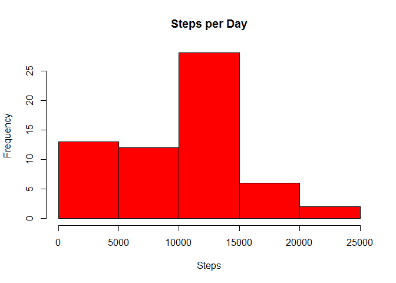
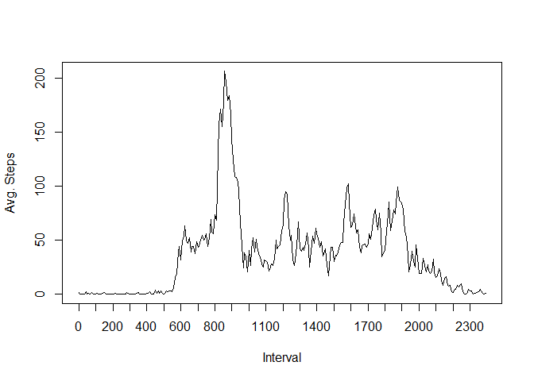
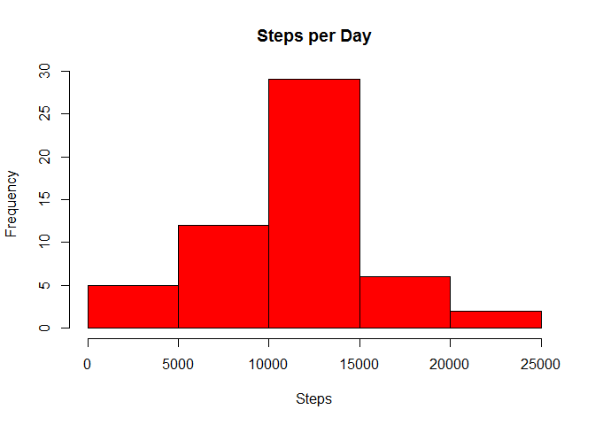
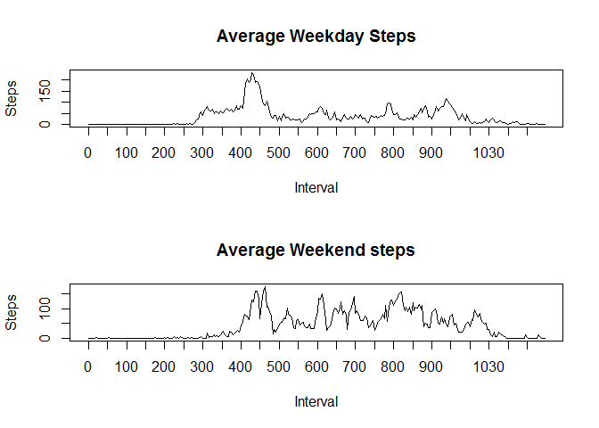

# Reproducible Research: Peer Assessment 1

# Introduction 
This assignment makes use of data from a personal activity monitoring device. This device collects data at 5 minute intervals through out the day. The data consists of two months of data from an anonymous individual collected during the months of October and November, 2012 and include the number of steps taken in 5 minute intervals each day.

# Loading and preprocessing the data

## Data Source
The data set was provided by the Reproducible Research class in a zip file. This zip file must be unpacked and the resulting CSV file, "activity.csv", must be present in the same directory as the analysis code.
   
## R Libraries Needed for Analysis

```r
library(dplyr)
```

```
## 
## Attaching package: 'dplyr'
## 
## The following objects are masked from 'package:stats':
## 
##     filter, lag
## 
## The following objects are masked from 'package:base':
## 
##     intersect, setdiff, setequal, union
```

## Load the Data
The data is loaded from a CSV file. We will copy the data into two data frames to removed NA values and substitute NA values for various analysis below

```r
data <- read.csv("activity.csv")
data_na_removed <- data
data_na_sub <- data
num_NA = 0
```

## Process the Data
Step through the data set and replace NA values with zeros. It's important to repalce NA's with zeros instead of just removing them, as the number of data samples present represents days in the study.

```r
for(i in 1:nrow(data))
{
   if(is.na(data$steps[i]))
      data_na_removed$steps[i] = 0
}
```

# What is mean total number of steps taken per day?

Extract the number of steps per day

```r
data_steps_per_date <- aggregate(steps ~ date, data = data_na_removed, FUN = sum, na.rm = FALSE)
```

## Make a histogram of the total number of steps taken each day

```r
hist(data_steps_per_date$steps, col = "red", main = "Steps per Day", xlab = "Steps")
```

 

## Reprot mean and median total number of steps taken per day
Mean:

```r
mean_steps <- mean(data_steps_per_date$steps)
mean_steps
```

```
## [1] 9354.23
```
Median

```r
median_steps <- median(data_steps_per_date$steps)
median_steps
```

```
## [1] 10395
```

# What is the average daily activity pattern?

Extract average of steps per 5 minute interval over all the days

```r
data_steps_per_interval <- aggregate(steps ~ interval, data = data, FUN = mean)
```

## Make a time series plot of the average daily activity pattern over 5-minute intervals

```r
plot(seq(1,288,1), data_steps_per_interval$steps, type = "l", xlab = "Interval", ylab = "Avg. Steps", axes = FALSE, frame.plot = TRUE)
axis(1, at = seq(1,288,12), lab = data_steps_per_interval$interval[seq(1,288,12)])
axis(2, at = c(0,50,100,150,200))
```

 

## Which 5-minute interval, on average across all the days in the dataset, contains the maximum number of steps?
Maximum number of steps

```r
max_steps <- max(data_steps_per_interval$steps)
max_steps
```

```
## [1] 206.1698
```
The 5-minute interval

```r
max_steps_index <- match(max_steps, data_steps_per_interval$steps)
max_steps_interval <- data_steps_per_interval$interval[max_steps_index]
max_steps_interval
```

```
## [1] 835
```

# Imputing missing values

There are a number of days/intervals where there are missing values (coded as NA). The presence of missing days may introduce bias into some calculations or summaries of the data.

Step through the data and replace NA values with the mean for that 5-minute interval. New dataset, "data_na_sub" is created for further analysis

## Create a new dataset that is equal to the original dataset but with the missing data filled in.

```r
for(i in 1:nrow(data))
{
   if(is.na(data$steps[i]))
   {
      data_na_sub$steps[i] <- data_steps_per_interval$steps[i]
      num_NA = num_NA + 1
   }
}
```

## Calculate and report the total number of missing values in the dataset (i.e. the total number of rows with NAs)

```r
num_NA
```

```
## [1] 2304
```

Extract number of steps per day

```r
data_sub_steps_per_date <- aggregate(steps ~ date, data = data_na_sub, FUN = sum, na.rm = FALSE)
```

## Make a histogram of the total number of steps taken each day and Calculate

```r
hist(data_sub_steps_per_date$steps, col = "red", main = "Steps per Day", xlab = "Steps")
```

 

## Report the mean and median total number of steps taken per day
Reprot mean and median total number of steps taken per day. These values differ from the estimates in the first part of the analysis, as the NA values are now replaced with the mean for the 5-minute interval. This allows the average of the data to be spread across all the days.

Mean:

```r
mean_sub_steps <- mean(data_sub_steps_per_date$steps)
mean_sub_steps
```

```
## [1] 10766.19
```

Median:

```r
median_sub_steps <- median(data_sub_steps_per_date$steps)
median_sub_steps
```

```
## [1] 10765.59
```

# Are there differences in activity patterns between weekdays and weekends?

## Create a new factor variable
In order to look at the weekdays and weekends separately, we will first separate the data using factors with two levels - "weekday", and "weekend" 

```r
enum_day <- factor(c("Weekday","Weekend"))
data_enum <- weekdays(as.Date(data_na_sub$date))
data_na_sub_weekday <- cbind(data_na_sub, "Day" = data_enum)
data_na_sub_dates <- cbind(data_na_sub_weekday, "Weekday" = enum_day[1])
```

Go through the data and mark Saturdays and Sundays as weekends, and the rest as weekday

```r
for(j in 1:nrow(data_na_sub_dates))
{
   if(as.character(data_na_sub_dates$Day[j]) == "Saturday" | as.character(data_na_sub_dates$Day[j]) == "Sunday")
      data_na_sub_dates$Weekday[j] = enum_day[2]
}
```

Remove unused comlums from the data

```r
data_na_sub_dates$Day <- NULL
```

Group the average 5-minute interval per weekend and weekday

```r
data_na_sub_dates_interval <- group_by(data_na_sub_dates, interval, Weekday)
data_na_sub_dates_avg_interval <- summarize(data_na_sub_dates_interval, mean(steps, na.rm = TRUE))
colnames(data_na_sub_dates_avg_interval) <- c("interval", "Weekday", "steps")
```

## Make a time series plot of the average daily activity pattern over 5-minute intervals for weekdays vs. weekends

```r
par(mfrow=c(2,1))

plot(seq(1,288,1), data_na_sub_dates_avg_interval$steps[data_na_sub_dates_avg_interval$Weekday == "Weekday"], type = "l", xlab = "Interval", ylab = "Steps", main = "Average Weekday Steps", axes = FALSE, frame.plot = TRUE)
axis(1, at = seq(1,288,12), lab = data_na_sub_dates_avg_interval$interval[seq(1,288,12)])
axis(2, at = c(0,50,100,150,200))
 
plot(seq(1,288,1), data_na_sub_dates_avg_interval$steps[data_na_sub_dates_avg_interval$Weekday == "Weekend"], type = "l", xlab = "Interval", ylab = "Steps", main = "Average Weekend steps", axes = FALSE, frame.plot = TRUE)
axis(1, at = seq(1,288,12), lab = data_na_sub_dates_avg_interval$interval[seq(1,288,12)])
axis(2, at = c(0,50,100,150,200))
```

 


